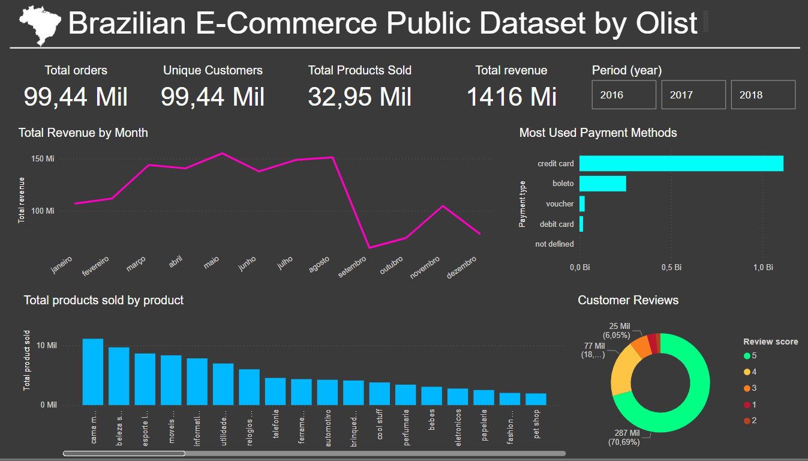

# Brazilian E-Commerce Public Dataset by Olist
The dataset has information of 100k orders from 2016 to 2018 made at multiple marketplaces in Brazil.

Its features allows viewing an order from multiple dimensions: from order status, price, payment and freight performance to customer location, product attributes and finally reviews written by customers. We also released a geolocation dataset that relates Brazilian zip codes to lat/lng coordinates.

## Available at:
https://www.kaggle.com/datasets/olistbr/brazilian-ecommerce

## Power BI relations

### 1. olist_orders_dataset (main)
### 2. olist_order_items_dataset
#### product_id -> olist_products_dataset
#### seller_id -> olist_sellers_dataset

## How to use

### 1. Use the "main.ipynb" Notebook for the data extraction and processing
### 2. Use the "dashboard.ipynb" Notebook to develop a simple dashboard in Python language 
### 3. The main dashboard was created in Power BI and is available in the "dashboard.pbix" file

