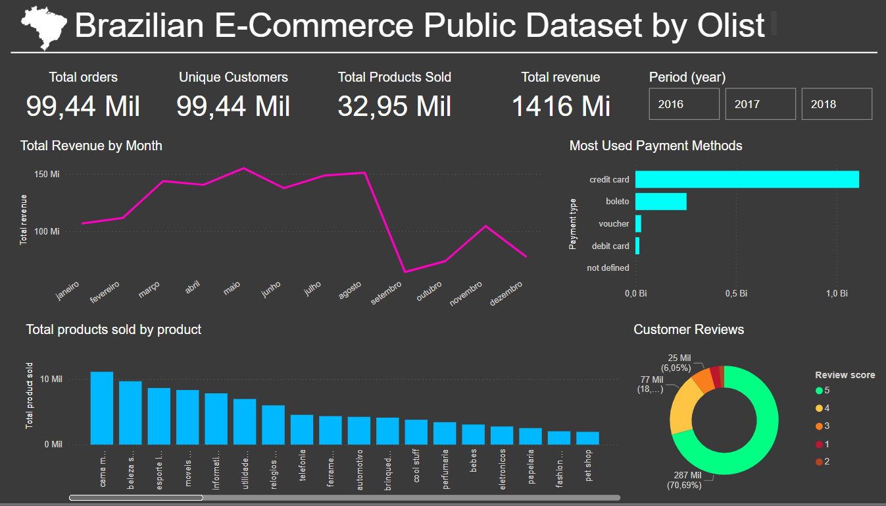

# Brazilian E-Commerce Public Dataset by Olist
This repository contains analyses based on the Brazilian E-Commerce Public Dataset by Olist, which includes information on 100,000 orders placed between 2016 and 2018 across multiple marketplaces in Brazil.

The dataset provides a comprehensive view of e-commerce orders, covering order status, pricing, payments, shipping performance, customer location, product attributes, and customer reviews. Additionally, a geolocation dataset is available, linking Brazilian ZIP codes to latitude/longitude coordinates.

## 📌 Data Source
The dataset is available on Kaggle:
🔗 [Brazilian E-Commerce Public Dataset](https://www.kaggle.com/datasets/olistbr/marketing-funnel-olist)

## 📊 Power BI Data Relationships
The key relationships in the Power BI data model are:

### 1️⃣ olist_orders_dataset (main table)
### 2️⃣ olist_order_items_dataset

🔗 product_id → olist_products_dataset

🔗 seller_id → olist_sellers_dataset

## How to Use
### 1️⃣ Data Extraction and Processing

Use the main.ipynb notebook to load and process the data.

### 2️⃣ Python Dashboard Development

The dashboard.ipynb notebook provides a simple dashboard implementation in Python.

### 3️⃣ Power BI Dashboard

The main dashboard was built in Power BI and is available in the dashboard.pbix file.

